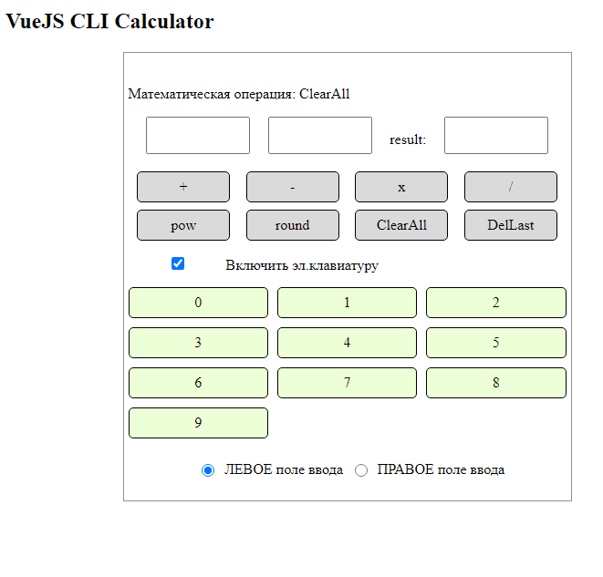

# app5

## Project setup
```
npm install
```

### Compiles and hot-reloads for development
```
npm run serve
```

### Compiles and minifies for production
```
npm run build
```

### Customize configuration
See [Configuration Reference](https://cli.vuejs.org/config/).

Настало время внедрить новый функционал: экранную клавиатуру. 
Необходимо сделать:

1) Добавить чекбокс, которым можно скрывать и показывать блок с экранной клавиатурой.

2) Вывести кнопки от 0 до 9 и кнопку удаления последнего введенного символа
- Кнопки 0 - 9 выводить через директиву v-for
- Нажатия на кнопки должны менять данные, связанные, через v-model с текстовыми полями.

3) Добавить группу из 2 радиокнопок, которые будут указывать - в какое из полей ввода вводится
символ (или из какого поля удаляется последний введенный символ).  

Примерное изображение того что получилось через 3 дня:
